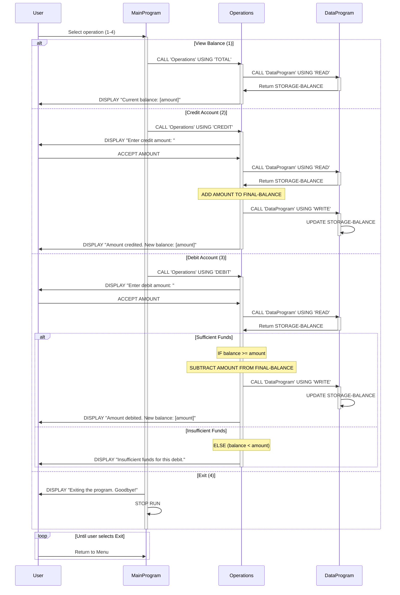

# COBOL Student Account Management System Documentation

This documentation describes the legacy COBOL codebase for managing student account operations, including balance inquiries, credits, and debits.

## System Overview

The Student Account Management System is a three-module COBOL application that provides a menu-driven interface for managing student financial accounts. It processes balance inquiries, credit deposits, and debit withdrawals while enforcing business rules around account integrity and fund availability.

---

## Module Descriptions

### 1. **main.cob** — MainProgram (Entry Point)

**Purpose:**
Entry point for the application that provides a user-facing menu interface for account operations.

**Key Functions:**
- Displays an interactive menu loop offering four operations:
  - **View Balance**: Display the current account balance
  - **Credit Account**: Add funds to the account
  - **Debit Account**: Withdraw funds from the account
  - **Exit**: Terminate the program
- Accepts user input (choices 1-4) and routes requests to the Operations module
- Continues looping until the user selects the Exit option
- Validates user input and displays error messages for invalid selections

**Key Data Structures:**
- `USER-CHOICE`: Stores the user's menu selection (numeric)
- `CONTINUE-FLAG`: Controls the main loop (YES/NO)

---

### 2. **operations.cob** — Operations Module

**Purpose:**
Implements the business logic layer that executes account operations (balance inquiries, credits, and debits).

**Key Functions:**

#### TOTAL (View Balance)
- Retrieves the current account balance from the Data module
- Displays the balance to the user

#### CREDIT (Add Funds)
- Prompts the user to enter a credit amount
- Retrieves the current balance from the Data module
- Adds the credit amount to the balance
- Persists the updated balance to storage
- Displays the new balance to the user

#### DEBIT (Withdraw Funds)
- Prompts the user to enter a debit amount
- Retrieves the current balance from the Data module
- **Validates**: Checks if the account has sufficient funds (balance ≥ amount)
  - If sufficient funds exist: subtracts the amount, persists the new balance, and confirms the transaction
  - If insufficient funds: rejects the transaction and displays an error message
- Displays the new balance (if successful) or an error message (if insufficient funds)

**Key Data Structures:**
- `OPERATION-TYPE`: Identifies which operation to perform (TOTAL, CREDIT, DEBIT)
- `AMOUNT`: Stores the credit or debit amount supplied by the user
- `FINAL-BALANCE`: Holds the current or updated account balance

---

### 3. **data.cob** — DataProgram (Persistence Layer)

**Purpose:**
Manages the persistent storage and retrieval of the student account balance. Acts as the data access layer for all balance read/write operations.

**Key Functions:**

#### READ Operation
- Retrieves the current balance from storage and makes it available to the calling module

#### WRITE Operation
- Updates the stored balance with a new value provided by the calling module

**Key Data Structures:**
- `STORAGE-BALANCE`: Persistent balance variable (initialized to 1000.00)
- `OPERATION-TYPE`: Identifies whether to READ or WRITE the balance

---

## Business Rules for Student Accounts

1. **Initial Balance**: Every account starts with a balance of **$1,000.00**

2. **Credit Operations**: 
   - Credits can be applied without restrictions
   - No upper limit on account balance
   - Amounts are added to the current balance

3. **Debit Operations (Key Business Rule)**:
   - Debits are only permitted if **sufficient funds are available**
   - An account cannot go into negative balance (overdraft protection)
   - If a debit would result in a negative balance, the transaction is rejected with an error message
   - Only approved debits are persisted to storage

4. **Data Persistence**:
   - All balance changes (credits and debits) are immediately written to persistent storage
   - The current balance is always retrieved from persistent storage before performing operations
   - This ensures data consistency across user sessions

5. **User Interaction**:
   - The system operates in a loop until the user explicitly chooses to exit
   - All user inputs are validated before processing
   - Feedback (balance amounts, success messages, or error messages) is displayed after each operation

---

## Module Interaction Flow

```
MainProgram (Menu)
    ↓
    └─→ Operations (Business Logic)
         ↓
         └─→ DataProgram (Storage)
              ├─ READ: Retrieve balance
              └─ WRITE: Update balance
```

1. User selects an operation from the MainProgram menu
2. MainProgram calls Operations with the operation type
3. Operations executes the requested operation, calling DataProgram as needed for data access
4. DataProgram manages persistent balance storage
5. Results are displayed to the user, and control returns to the menu

---

## Future Modernization Considerations

- Consider migrating from COBOL to a modern programming language (Java, Python, Node.js, etc.)
- Implement a database (e.g., PostgreSQL, MongoDB) to replace file-based storage
- Add RESTful API endpoints for programmatic access
- Implement transaction logging and audit trails
- Add role-based access control and authentication
- Implement input validation and error handling improvements
- Add support for multiple accounts and user management

---

## Data Flow Diagram

The following sequence diagram illustrates the complete data flow of the application, showing how user interactions proceed through the MainProgram menu, to the Operations business logic, and down to the DataProgram persistence layer:



**Key Data Flow Observations:**

- **View Balance**: Shortest path—directly reads and displays current balance without modification
- **Credit Account**: Reads current balance, performs addition, writes updated balance
- **Debit Account**: Reads current balance, validates sufficiency, conditionally modifies and persists
- **Loop Pattern**: Menu returns to User after each operation until Exit is selected
